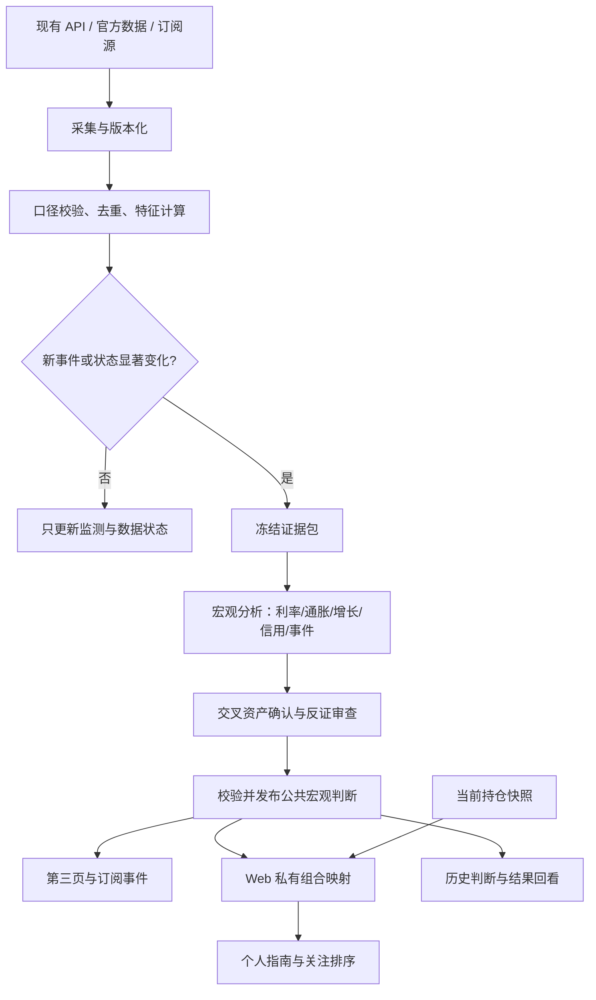

# MAX 宏观分析 Agent：产品与技术设计

日期：2026-09-09。状态：设计提案；已核实本地代码和外部一手资料，未实现、未部署、未启动监控。

## 1. 产品定位与当前基础

第三页应帮助用户回答四个问题：今天什么变化最重要，变化为什么重要，我的资产受什么影响，接下来什么证据会改变判断。主要交付物是可追溯、能持续更新的宏观判断及条件式行动指南。

第一版以美国宏观和美债为中心，连接美股、美元、黄金、能源与用户持仓；随后增加其他经济体。用户口述的“订阅证券形式”暂按新闻、政策、地缘政治事件订阅理解，具体覆盖可调整。

本次检查的仓库是 `/Users/max/Investment/investment-record`，分支 `main`，检查时 HEAD `bf1150b`。存在财报相关未提交修改，本任务仅新增研究材料。

| 当前证据 | 设计含义 |
|---|---|
| `components/navigation-dock.tsx` 第三个入口为 `/macro` | 在现有第三页建设，保留浮动 Dock |
| `app/macro/page.tsx` 是空白占位页 | 可重新组织信息，不需要兼容已上线宏观交互 |
| `lib/macro-dashboard.ts` 保留 V1：事实、传导、影响、事件、来源 | 复用语义；扩展为 V2，不把静态 JSON 当持续监测系统 |
| 已有 React 19、Vinext、Tailwind、shadcn 风格组件、Drizzle | 延续前端与数据库工具 |
| Pipeline 已有 Cloudflare Workflows、D1、R2、Cron 和模型分析链 | 增加独立宏观模块与 Workflow，复用运行基础 |
| Web 通过 service binding / 服务端代理访问分析后端 | 宏观也通过受控后端接口读取 |
| 当前路由发现 filings、analysis、fundamentals、quotes、earnings，未找到宏观专用路由 | 用户提到的 API 可能在其他服务；先按适配器设计，接入能力待文档核实 |

这只是本地源代码核查，不代表线上运行状态。当前 Pipeline 的 10 分钟 Cron 配置带有临时诊断注释，不应直接视为宏观监控的正式频率。现有 staging 配置尚无 D1 绑定；实施联调需要独立测试数据库。

## 2. 页面信息架构

顶部只保留“宏观分析”、最近有效更新时间、运行状态、订阅设置。主内容采用宽屏两列、移动端单列，沿用现有 Zinc / Indigo 与组件风格。

```text
宏观分析                   截至 09:42 · 部分数据延迟     [订阅]
今日判断：一句结论 + 相比上次改变了什么
增长：放缓   通胀：回落   利率：偏紧   信用：稳定

今天需要关注的 1–3 件事                 接下来 7 天
事实 / 预期差 / 传导 / 反证              CPI、FOMC、美债拍卖
与我的持仓的关联                        时间、共识、实际、修订

美债工作台
期限收益率表 + 今日/一周前/一月前曲线
实际利率、盈亏平衡通胀、曲线形态、拍卖与供给

情景与行动指南                         我的组合暴露
基准 / 上行风险 / 下行风险               因子 → 资产 → 持仓
触发条件 / 失效条件 / 下一次检查

事件时间线 · 历史判断 · 来源与数据健康
                                        [针对本次分析提问]
```

首页优先展示需要采取关注动作的信息；指标明细和新闻原文在展开区。聊天入口放在报告上下文中，提问自动绑定当前报告版本与来源。

交互规则：

- “与上次相比”给出结论变化及原因，重复新闻折叠到同一事件。
- 美债收益率显示 `%`，变化显示 `bp`，ETF 显示价格及回报，避免共用单位。
- 收益率曲线横轴使用真实期限数值；历史线使用同一日期截面，缺失期限断开，不制造曲线。
- 点击每条判断展开：原始事实、计算结果、解释、相反证据、信息截至时间。
- 日历支持“全部 / 高重要性 / 与我有关”；精确区分发布前、已发布、推迟、修订。
- 桌面表格紧凑、列对齐，表头排序显示方向与 `aria-sort`；移动端优先今日变化、指南、下个事件。
- 独立显示 fresh / delayed / stale / unavailable，以及数据覆盖度。月度 CPI 在下次发布前仍可有效，不能按新闻的 24 小时标准统一判过期。
- 没有新重大变化时显示“当前判断维持”，附监测时间；行情缺失时显示“无法验证市场反应”，不能显示“市场没有反应”。

## 3. 监测体系与数据依赖

### 3.1 六条分析主线

| 主线 | 第一版指标 | 核心分析问题 | 推荐来源 / 能力缺口 |
|---|---|---|---|
| 美债与政策利率 | 3M、2Y、5Y、10Y、30Y；10Y−2Y、10Y−3M；实际收益率；政策利率 | 哪段曲线在变？增长、通胀、政策还是供给压力？ | Treasury / FRED 日频；盘中收益率另需行情源 |
| 通胀 | CPI、核心 CPI、PCE、核心 PCE；盈亏平衡通胀；油价 | 通胀方向和意外程度？持续还是一次性？ | BLS / BEA / FRED；发布前共识需现有 API 或经济日历供应商 |
| 增长与就业 | 实际 GDP、非农、失业率、初请、零售 | 放缓幅度、广度，收入和需求有无恶化？ | BEA / BLS / Census / DOL，经现有 API 或 FRED 接入 |
| 流动性与信用 | Fed 资产、准备金、TGA、ON RRP、SOFR、HY/IG 利差 | 融资是否变紧？是否出现压力传导？ | Fed / NY Fed / Treasury / FRED；商业系列核对展示权限 |
| 跨资产验证 | SPY、QQQ、IWM、SHY、IEF、TLT、美元、黄金、油、VIX | 数据发布后资产反应是否支持解释？ | 现有报价 API 先审能力；历史分时、授权指数不能假定已有 |
| 政策与地缘事件 | FOMC、官员讲话、关税、制裁、财政、能源供应、重要冲突 | 信息可信度、政策状态和传导路径是什么？ | 官方公告/RSS + 授权新闻 API；原报道追溯与更正 |

第一版建议精选约 20–30 个基础序列，优先保证每个指标口径和可追溯性。PMI、完整新闻和盘中债券数据按供应商覆盖增加，不用模拟指标填补生产缺口。

FRED 候选序列清单：`DGS3MO`、`DGS2`、`DGS5`、`DGS10`、`DGS30`、`DFII10`、`T10YIE`、`CPIAUCSL`、`CPILFESL`、`PCEPI`、`PCEPILFE`、`PAYEMS`、`UNRATE`、`ICSA`、`GDPC1`、`RSAFS`、`WALCL`、`WRESBAL`、`WTREGEN`、`RRPONTSYD`、`SOFR`、`BAMLH0A0HYM2`、`BAMLC0A0CM`、`VIXCLS`。这是实施候选注册表，不是本次已逐个调用验证的能力清单；接入时逐项核实名称、单位、频率、季调、许可与延迟。

### 3.2 美债需要专门的分析器

至少输出四部分：

1. **曲线变化**：各期限变化、平行移动/陡峭化/平坦化、短端与长端分别变化多少。利差扩大可能来自短端下行，也可能来自长端上行，两者不能给同一解释。
2. **收益率构成**：名义收益率、实际收益率、盈亏平衡通胀并列。盈亏平衡通胀包含风险和流动性因素，不能当成纯粹通胀预测；引入期限溢价时必须标注模型估计。
3. **供给与拍卖**：发行计划、发行规模、投标倍数、间接投标者占比、历史同期限比较。拍卖 tail 需要拍卖前相同证券的 when-issued 收益率；缺失时不计算，不能拿昨天 10Y 收盘替代。
4. **资产关联**：SHY/IEF/TLT 是不同久期的债券 ETF，走势可用于市场确认，不能直接冒充对应期限的国债收益率。久期与凸性风险估算需要对应资产的有效元数据。

官方 Treasury 提供日频名义和实际曲线 XML 数据；这能支持日频框架，不能满足盘中秒级盯盘。[Treasury XML](https://home.treasury.gov/treasury-daily-interest-rate-xml-feed)

### 3.3 经济事件必须拆开实际、共识与修订

统一保存 `actual`、`consensus`、`previousAsReleased`、`previousRevised`、`consensusCapturedAt`、`scheduledAt`、`releasedAt`、`observedAt`。指标周期、同比/环比、季调口径、单位均为显式字段。

`surprise = actual − consensus` 只在同口径且共识采集时间早于发布时计算。需要跨事件比较时，用历史发布前共识误差的波动率做标准化；没有足够历史就显示原始差值。缺共识就仅分析趋势，不生成“超预期”。

Trading Economics 的经济日历有 Actual、Previous、Forecast、TEForecast、Revised 等字段；Forecast 与供应商自身预测 TEForecast 应分别存放。其流式接口采用 WebSocket，授权与实际覆盖需另行核实。[日历字段](https://docs.tradingeconomics.com/economic_calendar/snapshot/) · [流式接口](https://docs.tradingeconomics.com/economic_calendar/streaming/)

## 4. Agent 架构：固定流程内的有限自主分析

采用一个宏观 Agent 产品、若干职责明确的分析模块。模块不等于必须运行多个独立 LLM 进程。第一版先用确定性数据处理，加一次综合分析和一次质疑审查；事件复杂后再拆专门角色。



| 模块 | 输入 | 输出 | 实现原则 |
|---|---|---|---|
| 采集器 | API、日历、公告 | 版本化观测、原文引用 | 确定性代码，不调用 LLM 算数 |
| 特征与变化检测 | 时序、事件、历史状态 | 趋势、预期差、异常、候选事件 | 口径校验、阈值、业务时间窗口 |
| 宏观分析器 | 冻结证据包 | 状态、传导、替代解释、情景 | 结构化 LLM 输出，所有数字引用事实 ID |
| 质疑审查器 | 证据 + 初稿 | 反证、缺口、支持/降级/拒绝发布 | 检查因果跳跃、重复证据、已定价假设 |
| 发布校验器 | 候选分析 | 可发布版本 | 代码检查引用、时间、数值、结构及状态 |
| 组合映射器 | 宏观因子 + 持仓 | 暴露排序、条件式检查项 | 第一版规则映射，独立版本，默认私有 |
| 回看模块 | 旧判断 + 到期事实 | 延续/失效/需修订及原因 | 到期后记录，不自动改生产权重 |

自主工具限定为查询指标、查找可信事件、比较两时点、检索历史判断、读取公开证券暴露信息。单次分析最多两轮补充检索；缺关键证据则降级。报告正文或新闻里的指令不触发工具、更改订阅或修改数据。

“审查通过”只表示满足证据和发布条件，不表示预测正确。两个模型赞同也不是两份独立证据。

### 4.1 状态判断

先计算“增长变化方向 × 通胀变化方向”，再加政策、流动性、信用压力覆盖层。允许 mixed / uncertain，不强迫所有时段落入单一周期标签。

每条主线保留 level、trend、momentum、surprise、freshness、evidenceIds。增长和通胀采用慢频发布驱动，市场压力采用快频更新；一根分钟 K 线不直接翻转长期宏观状态。

状态变化需要持续性、多个不同指标确认与滞回，避免阈值附近来回提醒。第一版权重和阈值写入版本化配置，由历史样本校准，不使用 LLM 自报的“87%”当预测概率。

置信信息分为“数据覆盖度”和“证据一致性”。只有后续通过样本外校准的事件概率，才允许显示百分比概率。

### 4.2 传导模型

统一路径：**事件 → 增长/通胀/政策/流动性 → 折现率/现金流/风险溢价 → 资产暴露**。

每条路径标明事实与假设。比如“长期收益率上升”是事实，“财政供给担忧是主因”需要拍卖、供给计划或其他证据，不能只凭收益率变化下结论。“已有定价”需要发布前后行情、预期和比较窗口支撑，只能给出有限证据下的评估。

组合第一版使用透明的暴露标签：长久期债券、长久期成长股、信用敏感、能源敏感、美元收入等。没有估计模型就只提供方向和机制；不能用标签生成精确损益。期权先标记非线性风险，只有具备可靠 Greeks 和情景输入后才计算。

### 4.3 条件式指南的固定格式

每条指南包含：事实、与预期/前值的差别、影响路径、相关资产、关注动作、触发条件、失效条件、时间范围、下一检查点、来源、缺失信息。

**纯示例，不代表当前市场结论：**

> 核心通胀高于已冻结的发布前共识，随后 2Y 与 10Y 实际收益率同步上升。短期折现率压力可能增加。请优先检查组合中长久期资产的集中度；只有后续价格持续确认且没有相反的增长证据时，才把它升级为持续风险情景。若实际收益率回落到事件前区间，或后续就业数据明显转弱，重新审查判断。下一检查点：发布后 60 分钟及下一个美股收盘。

第一版动作类型：观察、检查暴露、比较情景、等待确认、重新评估。以后若增加具体调整建议，先纳入用户投资期限、风险预算、现金需求和限制条件。

## 5. 持续监测与提醒

“实时”拆成数据源延迟、采集延迟、分析延迟、页面延迟四段分别记录，不能只显示报告生成时间。

| 对象 | 第一版建议节奏 | 触发行为 |
|---|---|---|
| 慢频宏观序列 | 按官方发布日历，平时低频检查 | 新发布或修订才更新分析 |
| 日频 Treasury / 信用数据 | 预期发布后检查，失败退避 | 新交易日数据到齐后计算 |
| CPI / 非农 / FOMC | 发布窗口每分钟检查，目标上游到达后 1–5 分钟内发布初评 | 冻结共识，T+5、T+30、收盘按新证据补评 |
| 市场代理行情 | 在覆盖市场时段每 5 分钟采集，受供应商配额限制 | 异常且影响状态时触发，普通波动只落数据 |
| 新闻与政策 | 每 5–15 分钟增量拉取 | 先去重、评级，再触发分析 |
| 综合判断 | 每个美国交易日盘前/盘后摘要；周末复核慢变量 | 复用事件分析，形成变化摘要 |
| 前端 | 页面可见时 30–60 秒条件请求，失焦减频 | 读取已发布版本，不触发模型分析 |

以上是待联调验收的目标，不是现有服务保证。官方日频数据无法补出盘中价格；上游若仅提供 WebSocket，第一版可先用其 REST 快照，真正需要持续流式接入时再设计专用连接服务。Cron 使用 UTC；市场和事件调度按 `America/New_York` 转换，页面默认 `Asia/Shanghai`，处理夏令时和交易所假日。[Cron 文档](https://developers.cloudflare.com/workers/configuration/cron-triggers/)

订阅按主题、资产、事件类型和重要性配置，支持仅持仓相关、静默时段、每日摘要、暂停、恢复及已读。第一版交付站内提醒；外部渠道按用户选择再接。

提醒级别：P1 重要状态改变或高相关重大事件，P2 需要关注的更新，P3 收入摘要。严重程度由影响、可信度、意外程度、用户相关性和新颖度共同排序，权重是产品配置。

去重键：`ownerId + canonicalEventId + materialRevision + channel`，数据库唯一约束；同一新闻的转发不产生新提醒。重要更正或推翻旧结论产生新版本，并链接原提醒。设冷却期、每日上限和严重升级例外。

运行记录包含 expectedNextRunAt、lastAttemptAt、lastSuccessAt、lag、errorCode、连续失败次数。连续失败单独产生运行告警；“任务失联”需要平台告警或独立心跳检查，不能指望已经不运行的 Cron 自己报告。

## 6. 数据契约与存储

所有数据先经适配器变为统一契约。后端 API 原有命名不影响分析器。

```ts
type Observation = {
  id: string; seriesId: string; value: number | null;
  unit: string; frequency: string; seasonalAdjustment: string;
  period: string; observationDate: string;
  releasedAt: string | null; observedAt: string;
  vintageDate: string | null; sourceId: string; rawRef: string;
  quality: 'observed' | 'estimated' | 'proxy' | 'missing';
};

type MacroFinding = {
  id: string; eventId: string; asOf: string;
  factIds: string[]; calculationIds: string[];
  hypothesis: string; transmission: string[];
  contraryEvidenceIds: string[]; missingEvidence: string[];
  affectedFactors: string[]; horizon: string;
  confirmationConditions: string[]; invalidationConditions: string[];
  nextReviewAt: string | null;
};
```

上述为示意，实施需定义枚举、单位系统和完整 Schema。

报告必须包含 `schemaVersion`、`reportId`、`asOf`、`generatedAt`、`dataCutoff`、`freshnessBySource`、`coverage`、`previousReportId`、`changes`、`findings`、`scenarios`、`sourceIds`、`inputHash`、`modelVersion`、`promptVersion`、`ruleVersion`。

时间处理：`observationDate` 是指标所属时期，`releasedAt` 是公众可得时间，`observedAt` 是系统实际获取时间。FRED 的 vintage 通常是日期粒度，不足以证明某条数据在当天发布前已可得；历史事件回放还需要官方发布时间和冻结共识。系统自身可得时间采用 `max(releasedAt, observedAt)`；历史重建的市场可得时间单独标注来源和精度。

推荐逻辑表：

| 存储 | 内容与关键约束 |
|---|---|
| Pipeline D1 `macro_series` | 指标元数据、频率、单位、来源、可用性策略 |
| Pipeline D1 `macro_observations` | `(seriesId, period, sourceId, vintage)` 唯一；保留修订，不覆盖历史 |
| Pipeline D1 `macro_events` | canonical event、版本、发布日期、共识、状态、原文定位 |
| Pipeline D1 `macro_runs` | 幂等输入 hash、租约、步骤状态、成本与错误 |
| Pipeline D1 `macro_publications` | 不可变报告版本、上一版、输入引用；当前版本指针 |
| Web D1 `macro_subscriptions` / `macro_alerts` | ownerId、规则、已读、投递状态与唯一去重键 |
| Web D1 `macro_portfolio_impacts` | reportId + portfolioSnapshotId，私有组合映射缓存 |
| R2 `macro/raw/`、`macro/evidence/` | 原始观测/允许存档的文本、冻结证据包、hash 与索引 |

新闻按实际许可存全文或短摘录+URL，标注存储策略。高频历史批量归档 R2，D1 保留热数据和检索索引；初期用日期、主题和结构化筛选检索证据，未测得检索瓶颈前无需向量数据库。

宏观公共报告与个人组合影响分开版本化：持仓更新只让个人映射失效，不让整个宏观页报错。不得把带持仓的数据发布到当前匿名财报代理或共享缓存中；个人映射使用已验证的用户身份隔离，若尚无用户身份机制，先展示公共宏观分析和本地会话映射。

## 7. 接口与代码落点

以下均为拟新增接口，不是当前已存在接口。

| 接口 | 功能 |
|---|---|
| `GET /api/macro/v1/overview` | 最新有效报告、变化、覆盖和运行状态 |
| `GET /api/macro/v1/series/:id?from=&to=&vintage=` | 指标历史与版本，限制窗口和点数 |
| `GET /api/macro/v1/events?from=&to=&importance=` | 日历/已发布事件，游标分页 |
| `GET /api/macro/v1/reports/:id` | 读取不可变报告与证据 |
| `GET /api/macro/v1/portfolio-impact` | 私有组合映射及快照版本 |
| `GET/PUT /api/macro/v1/subscriptions` | 当前用户订阅配置 |
| `GET /api/macro/v1/alerts` | 用户提醒流 |
| `POST /api/macro/v1/questions` | 对指定 reportId 提问，限流、token 上限 |
| `POST /api/internal/macro/refresh` | 受保护的运维触发，202 + runId |

后端在现有 Pipeline 中增加对应的宏观读路由，Web 使用独立宏观客户端及 service binding 代理。公共数据缓存可用 ETag；私有映射不进入共享缓存。上游错误返回明确 stale / unavailable，不转成空数组成功。

建议代码结构：

```text
app/macro/page.tsx
components/macro/{overview,yield-curve,event-feed,scenario-guide,subscriptions}.tsx
shared/macro-contract/{observation,event,report,subscription}.ts
lib/macro/{client,portfolio-impact,subscription-store}.ts
workers/pipeline/src/macro/
  providers/{existing-api,fred,treasury,news}.ts
  series-registry.ts
  normalize.ts
  features.ts
  triggers.ts
  evidence.ts
  analyze.ts
  review.ts
  publish.ts
  repository.ts
  read-api.ts
workers/pipeline/src/macro-workflow.ts
tests/pipeline/macro-*.test.ts
tests/macro-*.test.tsx
```

执行流程：Cron 查询到期来源 → 增量采集 → 标准化 → 生成候选事件 → 以输入版本创建唯一 Workflow → 冻结证据 → 分析 → 质疑 → 代码校验 → 先写完整产物，再原子切换发布指针。失败保留上一版。

利用 D1 唯一键/条件更新实现任务抢占；发布时比较数据 cutoff 或序号，避免迟到的旧任务覆盖较新报告。提醒在发布后幂等处理；需要外部投递时用投递状态表和重试恢复，不能仅依赖一次网络发送。

现有 Cloudflare Workflows 提供持久步骤与自动重试，可复用此运行模型。[Workflows 文档](https://developers.cloudflare.com/workflows/)

## 8. GitHub 项目研究与采用范围

本次保存了固定 commit 的 README、关键代码与依赖声明，未安装运行这些项目，也未验证作者的收益或准确率主张。检索结果可能落后于实际 HEAD，以下以抓取的固定版本为准。

| 项目 / 固定版本 | 实際核查 | 值得采用 | 对本项目的取舍 |
|---|---|---|---|
| [TradingAgents](https://github.com/TauricResearch/TradingAgents) `be952b8` | `graph/setup.py`、`dataflows/fred.py`、macro tool、memory、pyproject | 分析→反证→风险审查；FRED vintage 固定；恢复和决策记录 | 用 TS Workflow 重现必要职责；不整套引入 Python/LangGraph/多轮交易辩论 |
| [OpenBB](https://github.com/OpenBB-finance/OpenBB) `3e071fc` | README、FRED provider 的 series/calendar、LICENSE | 数据提供者适配为统一模型，前端/Agent 共用 | 已有后端优先直连；数据源大幅增加时再考虑 Python 数据服务 |
| [MacroCycle](https://github.com/ibpdas/macrocycle-ai-agent) `0ea9066` | `data_fetcher.py`、`business_cycle.py`、`ai_agent.py` | 模块化指标→周期状态→解释 | 原型有模拟/随机序列、默认值和启发式 confidence；不直接移植生产数据或概率逻辑 |
| [Ultimate Macroeconomics Dashboard](https://github.com/aleksey-karasev/Ultimate-Macroeconomics-Dashboard) `b91d5ff` | README、compose、`agent/agent/graph.py` | supervisor 选择 SQL、图表、RAG 等专门工具；数据与展示分层 | 微服务、Postgres、Qdrant、Triton 等不作为本项目首期依赖 |

TradingAgents 此次快照的 `pyproject.toml` 为 0.4.0、Python >=3.10，并声明 LangGraph、LangChain、Pandas、yfinance 等依赖；这是源码声明，非可复现安装验证。其 FRED 实现已显式设置 `realtime_start` / `realtime_end`，值得采用该思想。[固定代码](https://github.com/TauricResearch/TradingAgents/blob/be952b8eccb49720509af544c6675233bc1f10d0/tradingagents/dataflows/fred.py)

MacroCycle README 的功能描述和效果数字不作为本设计的实证依据；代码中的模拟序列必须与真实数据隔离。[固定数据代码](https://github.com/ibpdas/macrocycle-ai-agent/blob/0ea906675dc7aa00b96a60025cf064765b6a9a2c/data_fetcher.py)

许可记录：TradingAgents 当前快照 Apache-2.0；OpenBB LICENSE 为 AGPLv3；Ultimate 为 MIT；MacroCycle 快照未发现明确 LICENSE。这里只参考架构，不复制未明确授权代码。运行库及数据源许可在实际采用版本锁定时复核。

## 9. 最小依赖与运行成本

| 分类 | 选择 | 用途 |
|---|---|---|
| 已有 | React / Vinext / Tailwind / 现有 UI | 宏观页和订阅界面 |
| 已有 | Workers / Workflows / D1 / R2 / Drizzle | 调度、状态、版本、原始证据 |
| 已有能力优先复用 | Pipeline 模型调用、重试及发布校验模式 | 接入结构化分析；宏观独立 prompt 与 schema |
| 建议新增 | `zod` | 外部数据和模型输出的运行时校验；若现有校验设施满足则可省略 |
| 按交互需要新增 | `echarts` | 收益率曲线、多轴历史、时间缩放；使用客户端按需加载，并配数据表 |
| 条件新增 | XML/RSS parser | 只在上游未提供规范 JSON 时使用，实施时选择并锁版本 |
| 外部服务 | 已有 API + FRED/Treasury + 可选经济日历/新闻 | 数据能力，具体套餐和权限待 API 盘点 |

Zod 与 ECharts 用官方仓库核实能力；具体安装版本在实施时兼容性检查后固定。[Zod](https://github.com/colinhacks/zod) · [ECharts](https://github.com/apache/echarts)

首期无需新增 Python 服务、LangGraph、Redis、Queue、Durable Object 或向量库。只有持续流式连接、大规模任务积压或检索召回实测提出需求时，才分别引入对应能力。

成本控制：普通轮询零 LLM 调用；同一事件共享公共分析；个人组合映射优先确定性规则。配置每日报告 token 上限、最大检索次数、最大分析次数与降级策略。

预算估算用公式而非未核实的报价：`月模型成本 = 各类运行次数 × (输入 tokens × 输入单价 + 输出 tokens × 输出单价)`，再加数据供应商、Worker/Workflow 和存储费用。例：每天 2 次摘要 + 最多 6 次事件分析、每次 2 个模型阶段，30 天最多约 480 个基础模型阶段；修复重试、问答另设预算，周末也按上限计。这是预算假设，不是当前用量或费用报价。

## 10. 验证方法与上线门槛

先验证数据与提醒是否可靠，再评价文字和情景判断。针对问题设计测试：

| 要验证的问题 | 验收方法 |
|---|---|
| 数值/单位是否正确 | % 与 bp、同比/环比、季调、缺值及基期零值的独立样例；计算值与输入逐项核对 |
| 有没有未来信息 | 冻结发布前共识、历史 vintage、日内发布时间；拒绝 cutoff 后证据 |
| 重复新闻会否刷屏 | 同一事件多源转发、重放、修订测试；逻辑提醒重复数为 0 |
| 失败是否覆盖好数据 | 429、超时、坏 JSON、模型缺引用；保留上一完整报告并显示降级 |
| 持仓变化是否影响公共页 | 新快照只重算个人映射；旧分析明确引用旧 snapshotId |
| 每句话有没有支撑 | 数值声明 100% 引用有效 fact/calculation ID；核心因果判断有证据与替代解释 |
| 多 Agent 是否真的有帮助 | 在同一冻结证据集对比单次分析 vs 分析+质疑；看错误率、遗漏、成本与延迟 |
| 监控是否及时 | 从上游可得时间到发布分别记录 p50/p95；达到约定 SLO 才宣称准实时 |

回放选取 CPI 意外、就业转弱、政策突变、拍卖异常、能源冲击及平静日等不同场景，分开发现集和样本外集。评价事实准确性、来源支持、关键事件漏报率、提醒精度、状态抖动和解释修订质量。

历史 LLM 可能从预训练记住结果，单靠历史回放不能证明预测能力。补充至少数周前瞻影子运行，记录当时输入与不可变判断。收益不是首期主要验收指标；未来若评估策略收益，必须定义交易规则、费用、滑点、基准、可执行时间与样本外区间。

第一版建议门槛：无未来证据、无伪造数字、无逻辑重复提醒、故障不覆盖有效结果；由人工标注样本评价重要事件遗漏与解释支持度。准实时 p95 目标仅对已约定的上游来源和发布窗口生效。

## 11. 实施顺序与完成定义

| 阶段 | 交付 | 完成标准 |
|---|---|---|
| P0 接口盘点 | 现有 API 能力矩阵、真实响应样例、系列注册表、V2 contract | 美债/日历/新闻/共识/历史与延迟逐项写明 available / missing / pending |
| P1 美债与宏观事实页 | 第三页、曲线、指标、未来 7 天日历、来源状态 | 能持续展示真实数据，错误/延迟状态可见 |
| P2 分析闭环 | 证据包、事件检测、分析+质疑、版本化报告、历史变化 | 每条指南含证据、条件、反证与检查点，故障恢复通过 |
| P3 持仓与订阅 | 私有暴露映射、主题订阅、站内提醒、去重与静默 | 页面关闭后仍监测，重新进入看到离线期间事件；个人数据隔离 |
| P4 扩展与校准 | 新闻覆盖、地缘事件、更精细盘中数据、外部提醒、评估 | 在影子运行证据上调整阈值，达到明确延迟和质量目标 |

最短完整闭环是“美债 + 核心宏观日历 + 条件式指南 + 站内订阅”，覆盖 P0–P3。P1 是事实面板里程碑，不能标记成 Agent 已完成。

本次交付已完成研究与设计；实际接入、代码实现、持续运行和线上验证均待后续实施。未核实的主要输入是用户现有宏观 API 文档、实时行情/共识覆盖、新闻权限与提醒渠道。

## 12. 可追溯材料

来源与固定代码快照见 [来源索引](../00_meta/source_index.md)，重要结论与状态见 [核查表](../00_meta/verification_table.json)，本地代码核查见 [现状记录](../04_working_notes/comparison_notes/local-code-audit.md)。这些记录支持架构研究，不构成生产连通性或投资效果验证。
